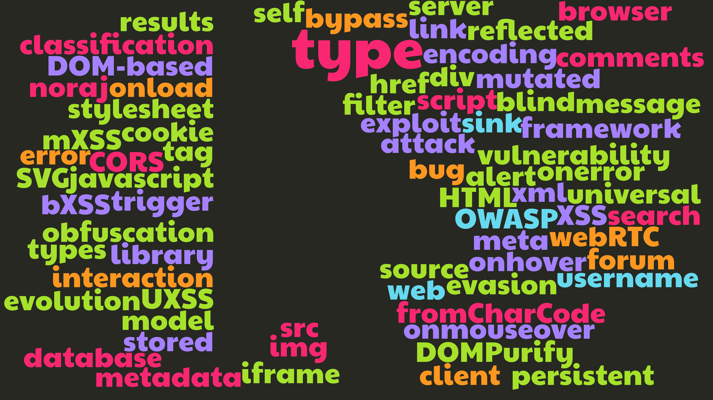

# XSS classification model

> Types of XSS evolution

**Note**: This is only the sources of the slideshow.

**Download / view**:

**Presentation**:

- Title: XSS classification model
- Subtitle: Types of XSS evolution
- Presented at: RTFMeet Rennes March 2020
- Date: 06/03/2020
- Created with [Marp](https://marp.app/)

**Author**:

- Alexandre ZANNI aka noraj
- Website: https://pwn.by/noraj/